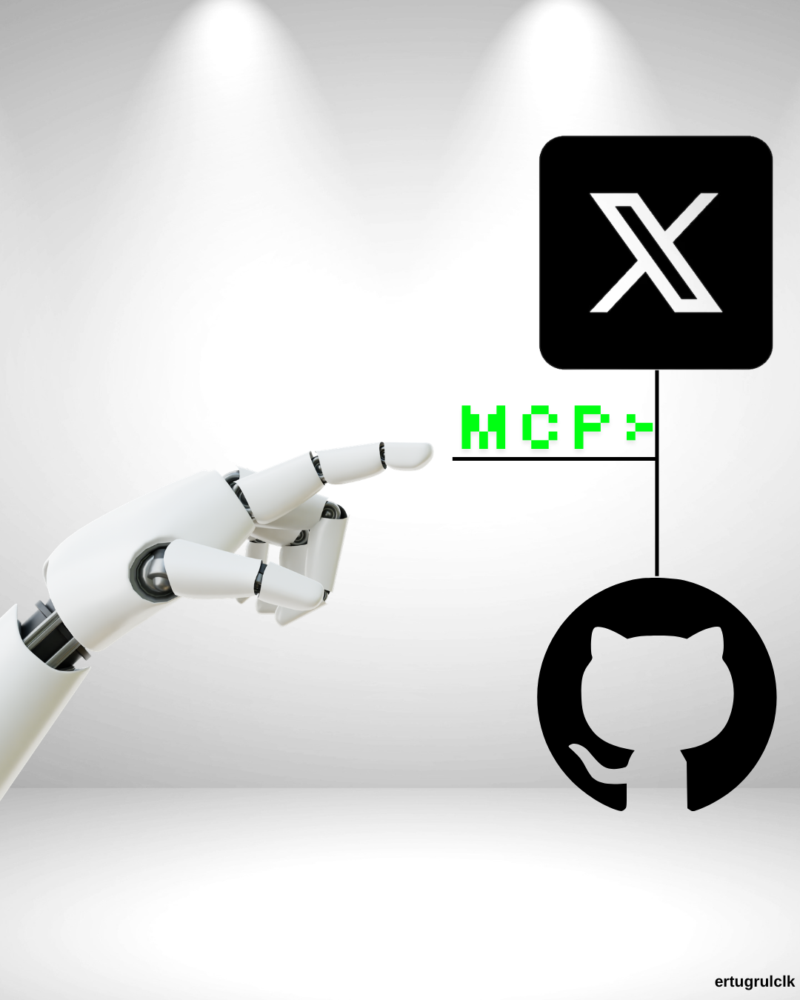

# 🤖 Twitter/X MCP Integration

<p align="center">
  
</p>

## 🎯 Why I Built This

As a **Vibe Coder**, my goal is to share my projects and ideas with the world **quickly, effectively, and automatically**. Managing social media content is time-consuming — but what if you could do it directly from your code editor, just by talking to AI?

That's exactly what I did.

## 🔗 How It Works

Using **MCP (Model Context Protocol)**, I gave GitHub Copilot inside VS Code the ability to communicate directly with the Twitter/X platform.

```
Me (Vibe Coder) → GitHub Copilot (AI) → MCP Server → Twitter/X API → Tweet Published
```

### The workflow is simple:

1. **While working in VS Code**, I want to share an idea or content
2. **I tell GitHub Copilot in natural language**: *"Post a tweet about this topic"*
3. **MCP Server** picks up the request and forwards it to the Twitter/X API
4. **Content is published instantly** — without leaving the editor!

## 🚀 The Vibe Coding Approach

This project reflects the spirit of modern software development:

- **Natural communication with AI** — Guiding through conversation instead of writing code
- **Rapid prototyping** — Going from idea to production in minutes
- **Automation-first** — Delegate repetitive tasks to AI
- **Multi-platform** — Manage multiple platforms from a single point

## 🛠️ Tech Stack

| Technology | Purpose |
|-----------|----------|
| **MCP (Model Context Protocol)** | AI-tool communication layer |
| **GitHub Copilot** | AI assistant |
| **VS Code** | Development environment |
| **Twitter/X API** | Social media integration |
| **Node.js** | MCP Server runtime |

## 💡 Motivation

As a developer, I'm constantly building new projects. I want to share each one on social media, tell the story behind it, and connect with the community. But instead of going to each platform and manually creating content every time, I wanted to do it **without leaving my development environment**.

**Result:** By talking to AI, I can instantly share my thoughts with the world. This isn't just a tool — it's part of the **next-generation developer experience**.

---

<p align="center">
  <b>Code the future with Vibe Coding 🚀</b><br/>
  <i>Built with ❤️ by <a href="https://github.com/Ertugrulclk">Ertuğrul Çelik</a></i>
</p>
